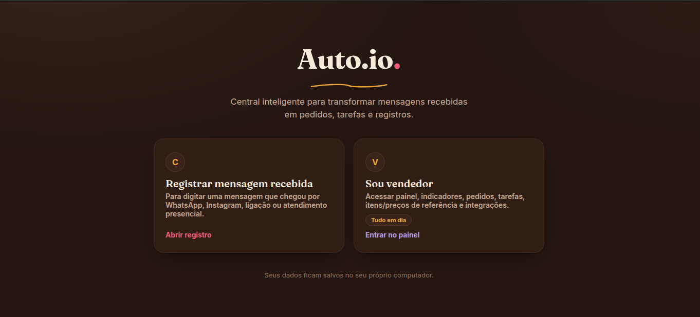

# Auto.io

Central inteligente para transformar mensagens recebidas e anotações soltas em registros organizados: clientes, pedidos personalizados, tarefas de produção e logs.

O projeto nasceu como um estudo de automação de processos (AS-IS/TO-BE) e evoluiu para o MVP funcional em [`app/`](app/README.md): uma aplicação Node.js própria com IA local via LM Studio.

<p align="center">
  
</p>

## Aplicação principal

O MVP executável está em [`app/`](app/README.md). Leia o README dele para instruções completas de instalação, configuração e uso.

- Registro de mensagem recebida por WhatsApp, Instagram, ligação ou atendimento presencial.
- IA local via LM Studio classifica a mensagem como pedido, tarefa ou conversa, com fallback por regras se a IA estiver indisponível, lenta ou fora do ar.
- Cardápio do dia (pronta retirada): itens com preço e quantidade pronta agora, com baixa a cada venda e opção de encerrar o dia.
- Vitrine do dia ao lado da conversa: quem envia a mensagem vê o que está pronto, o preço e o que só sai por encomenda.
- Painel do vendedor protegido por senha, organizado em blocos: indicadores, entrada de mensagens, cardápio do dia, registros e ajustes.
- Registro manual como alternativa segura à IA.
- Persistência local em `app/data/db.json` (escrita atômica) e exportação em CSV.
- Integração opcional com Google Sheets via Apps Script.

### Como rodar

Requer Node.js 18 ou superior.

```bash
cd app
npm install
copy .env.example .env      # Windows (no Linux/macOS: cp .env.example .env)
npm start
```

Depois acesse `http://localhost:3000`.

Antes do primeiro uso, gere uma chave de sessão e preencha `SESSION_SECRET` no `app/.env` (sem ela, o acesso ao painel cai a cada reinício do servidor):

```bash
node -e "console.log(require('crypto').randomBytes(32).toString('hex'))"
```

A senha do painel fica em `SELLER_PASSWORD`, no mesmo arquivo. Para usar a IA, abra o LM Studio, carregue um modelo instruct e inicie o servidor local em `http://localhost:1234`.

## Estrutura do repositório

| Caminho | Conteúdo |
| --- | --- |
| [`app/`](app/README.md) | MVP funcional da Auto.io (Node.js + front-end + IA local). É a entrega atual do projeto. |
| [`docs/`](docs/) | Documentação de processo do `app/` atual: escopo, AS-IS (atendimento manual de pedidos), TO-BE (fluxo com a Auto.io) e casos de teste. |
| [`workflow-auto-io/`](workflow-auto-io/) | Histórico: versões (v1 a v3) de um workflow n8n explorado antes do MVP. v1/v2 tratam da qualificação de leads da própria Auto.io por e-mail; v3 (`DocesAtendimentoBot`) foi o protótipo n8n do bot de atendimento que deu origem ao `app/`. |
| [`testes-n8n/`](testes-n8n/) | Histórico: exports de workflows n8n usados em testes pontuais (e-mail, WhatsApp, evento). |
| [`instalacao-local-n8n/`](instalacao-local-n8n/) | Histórico: anotações de instalação do n8n localmente (Ubuntu). |
| [`images/`](images/) | Imagens usadas pela documentação em `workflow-auto-io/`. |

> **Nota sobre o histórico do projeto:** os materiais em `workflow-auto-io/` (v1/v2), `testes-n8n/` e `instalacao-local-n8n/` vêm da fase exploratória do projeto, quando a automação era feita via n8n. O MVP atual em `app/` seguiu por um caminho diferente — uma aplicação Node.js própria com IA local, sem depender de n8n — e é o que os documentos em `docs/` descrevem hoje.

## Licença

Distribuído sob a licença MIT — veja [`LICENSE`](LICENSE).
