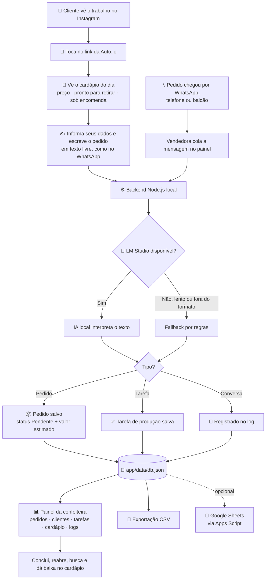

# Auto.io

Central inteligente que transforma o pedido informal — aquele que hoje chega solto no WhatsApp — em registro organizado: clientes, pedidos personalizados, tarefas de produção e logs.

O cliente descobre a confeiteira no **Instagram**, toca no **link da Auto.io** e faz o pedido escrevendo do jeito que escreveria numa mensagem. Uma IA local interpreta o texto e o pedido chega estruturado no painel da vendedora — sem ninguém copiar nada de lugar nenhum.

O projeto nasceu como um estudo de automação de processos (AS-IS/TO-BE) e evoluiu para o MVP funcional em [`app/`](app/README.md): uma aplicação Node.js própria com IA local via LM Studio.

## O problema, em uma frase

O WhatsApp é ótimo para conversar e péssimo para registrar. O pedido chega misturado com conversa pessoal, sem campo de produto, quantidade, data ou pagamento — e acaba no papel, no print ou na memória da vendedora. A Auto.io tira do WhatsApp o papel de balcão e devolve a ele o papel de conversa.

| Papel | Antes | Depois |
| --- | --- | --- |
| **Descoberta** — o cliente conhece o trabalho | Instagram | Instagram (não muda) |
| **Pedido** — o cliente encomenda | WhatsApp, em texto solto | **Link da Auto.io** |
| **Registro** — o pedido vira dado | Papel, memória, print | Base local estruturada, com status |

## Fluxo do processo



O caminho principal é o do cliente. O caminho de baixo existe porque a realidade é teimosa: enquanto algum pedido ainda chegar por outro canal, a vendedora cola a mensagem no painel e o mesmo motor faz o trabalho.

**A IA nunca é ponto único de falha.** Se o LM Studio estiver desligado, travado ou devolver resposta fora do formato, o fallback por regras assume e o pedido do cliente é registrado do mesmo jeito.

## Aplicação principal

O MVP executável está em [`app/`](app/README.md). Leia o README dele para instruções completas de instalação, configuração e uso.

- **Tela do cliente (pública):** vitrine do dia ao lado da conversa, cadastro rápido e pedido em texto livre.
- **IA local via LM Studio** classifica a mensagem como pedido, tarefa ou conversa, com fallback por regras se a IA estiver indisponível, lenta ou fora do formato.
- **Cardápio do dia (pronta retirada):** item com preço, unidade e quantidade pronta, baixa a cada venda e ação de encerrar o dia.
- **Painel do vendedor protegido por senha**, organizado em blocos: Hoje, Entrada, Cardápio, Registros e Ajustes.
- **Registro manual** como alternativa segura à IA.
- **Persistência local** em `app/data/db.json` (escrita atômica) e exportação em CSV.
- **Integração opcional** com Google Sheets via Apps Script.

### Como rodar

Requer Node.js 18 ou superior.

```bash
cd app
npm install
copy .env.example .env      # Windows (no Linux/macOS: cp .env.example .env)
npm start
```

Depois acesse `http://localhost:3000`.

Antes do primeiro uso, gere uma chave de sessão e preencha `SESSION_SECRET` no `app/.env` (sem ela, o acesso ao painel cai a cada reinício do servidor):

```bash
node -e "console.log(require('crypto').randomBytes(32).toString('hex'))"
```

A senha do painel fica em `SELLER_PASSWORD`, no mesmo arquivo. Para usar a IA, abra o LM Studio, carregue um modelo instruct e inicie o servidor local em `http://localhost:1234`.

> **Sobre o link:** no MVP a aplicação roda localmente (`http://localhost:3000`), e o cenário do link do Instagram é demonstrado nesse ambiente. Publicar o link de verdade é uma etapa de infraestrutura (hospedagem ou túnel), fora do escopo funcional do projeto.

## Estrutura do repositório

| Caminho | Conteúdo |
| --- | --- |
| [`app/`](app/README.md) | MVP funcional da Auto.io (Node.js + front-end + IA local). É a entrega atual do projeto. |
| [`docs/`](docs/) | Documentação de processo do `app/` atual: escopo, AS-IS (atendimento manual de pedidos), TO-BE (fluxo com a Auto.io) e casos de teste. |
| [`workflow-auto-io/`](workflow-auto-io/) | Histórico: versões (v1 a v3) de um workflow n8n explorado antes do MVP. v1/v2 tratam da qualificação de leads da própria Auto.io por e-mail; v3 (`DocesAtendimentoBot`) foi o protótipo n8n do bot de atendimento que deu origem ao `app/`. |
| [`testes-n8n/`](testes-n8n/) | Histórico: exports de workflows n8n usados em testes pontuais (e-mail, WhatsApp, evento). |
| [`instalacao-local-n8n/`](instalacao-local-n8n/) | Histórico: anotações de instalação do n8n localmente (Ubuntu). |
| [`images/`](images/) | Imagens usadas pela documentação em `workflow-auto-io/`. |

> **Nota sobre o histórico do projeto:** os materiais em `workflow-auto-io/` (v1/v2), `testes-n8n/` e `instalacao-local-n8n/` vêm da fase exploratória do projeto, quando a automação era feita via n8n. O MVP atual em `app/` seguiu por um caminho diferente — uma aplicação Node.js própria com IA local, sem depender de n8n — e é o que os documentos em `docs/` descrevem hoje.

## Licença

Distribuído sob a licença MIT — veja [`LICENSE`](LICENSE).
