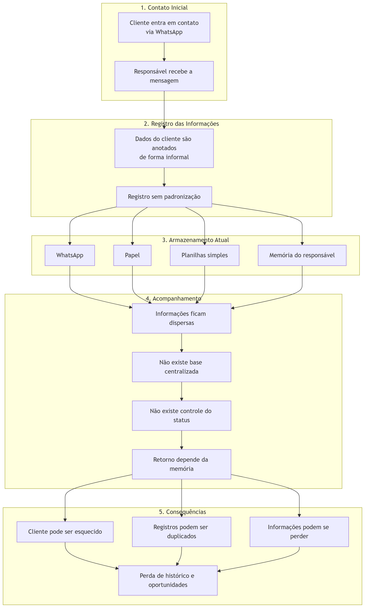

# Processo AS-IS — Controle de Clientes

## 1. Visão Geral

O processo atual de controle de clientes é manual, descentralizado e sem padronização. As informações ficam espalhadas entre WhatsApp, anotações em papel, planilhas simples e a memória do responsável pelo atendimento.

Esse modelo dificulta o acompanhamento dos clientes, reduz a rastreabilidade das informações e aumenta o risco de perda de oportunidades comerciais.

## 2. Fluxo Manual Atual

O fluxo atual acontece da seguinte forma:

1. O cliente entra em contato com a empresa, geralmente pelo WhatsApp.
2. O responsável recebe a mensagem e coleta os dados de forma informal.
3. As informações são registradas sem padrão, podendo ficar no WhatsApp, em papel, em planilhas simples ou apenas na memória do responsável.
4. O atendimento continua sem status definido e sem controle centralizado.
5. O retorno ao cliente depende da lembrança do responsável ou de buscas manuais.
6. Caso o acompanhamento falhe, o cliente pode ser esquecido, duplicado ou ter seu histórico perdido.

## 3. Gargalos e Impactos Identificados

| Gargalo                                     | Impacto no Processo                                                             |
| ------------------------------------------- | ------------------------------------------------------------------------------- |
| Falta de cadastro padronizado               | Dificulta consultas, atualizações e organização dos dados.                      |
| Ausência de base centralizada               | As informações ficam dispersas e difíceis de localizar.                         |
| Uso do WhatsApp como registro principal     | Compromete a rastreabilidade e mistura atendimento com armazenamento de dados.  |
| Dependência de anotações manuais ou memória | Aumenta o risco de esquecimento e erro humano.                                  |
| Planilhas sem padrão                        | Reduz a confiabilidade das informações registradas.                             |
| Duplicidade ou perda de registros           | Gera retrabalho e inconsistência no histórico do cliente.                       |
| Falta de controle do status do atendimento  | Dificulta saber se o cliente é novo, está em contato, pendente ou perdido.      |
| Ausência de lembretes e métricas            | Impede o acompanhamento de retornos e a avaliação do desempenho do atendimento. |

## 4. Diagrama do Processo AS-IS

O diagrama representa o fluxo manual atual, desde o contato inicial pelo WhatsApp até os principais problemas gerados pela falta de padronização, centralização e acompanhamento.

## 5. Síntese

O processo AS-IS mostra que o problema principal não é apenas a ausência de tecnologia, mas a falta de estruturação do controle de clientes. Antes da automação, é necessário organizar o fluxo, padronizar o registro das informações e definir uma forma clara de acompanhamento.
