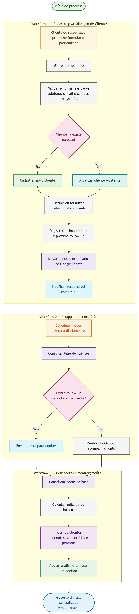

# Processo TO-BE — Controle de Clientes

## 1. Visão Geral

O processo TO-BE representa a proposta da Auto.io para transformar o controle manual de clientes em um fluxo digital, padronizado, centralizado e monitorável.

Na nova proposta, a entrada dos dados deixa de depender de registros informais em WhatsApp, papel ou memória do responsável. Em vez disso, as informações passam por workflows automatizados no n8n, responsáveis por validar, organizar, armazenar e acompanhar os dados dos clientes.

A solução foi estruturada em três workflows principais: cadastro e atualização de clientes, acompanhamento diário e geração de indicadores.

## 2. Fluxo Automatizado Proposto

O processo automatizado acontece da seguinte forma:

1. O cliente é registrado por meio de um formulário padronizado.
2. O n8n recebe os dados enviados.
3. O sistema valida e normaliza as informações, como telefone e e-mail.
4. O workflow verifica se o cliente já existe na base.
5. Se o cliente for novo, o sistema cria um novo registro.
6. Se o cliente já existir, o sistema atualiza o registro existente.
7. O sistema define ou atualiza o status do atendimento.
8. O próximo follow-up é registrado.
9. O responsável recebe uma notificação automática.
10. Um workflow agendado monitora clientes pendentes de retorno.
11. Um terceiro workflow consolida indicadores básicos para acompanhamento do processo.

## 3. Workflows da Solução

### 3.1 Workflow 1 — Cadastro e Atualização de Clientes

Esse workflow é responsável por receber os dados do formulário, validar as informações, verificar duplicidade e cadastrar ou atualizar o cliente na base centralizada.

Principais funções:

* receber dados do cliente;
* padronizar telefone e e-mail;
* verificar se já existe cliente com o mesmo telefone ou e-mail;
* criar novo registro ou atualizar registro existente;
* definir status inicial;
* registrar informações de acompanhamento;
* notificar o responsável.

### 3.2 Workflow 2 — Acompanhamento Diário

Esse workflow é executado de forma agendada para consultar a base de clientes e identificar registros com follow-up vencido ou pendente.

Principais funções:

* consultar clientes cadastrados;
* filtrar clientes com retorno pendente;
* identificar follow-ups vencidos;
* enviar notificação para a equipe responsável.

### 3.3 Workflow 3 — Indicadores e Monitoramento

Esse workflow consolida informações básicas do processo para apoiar o acompanhamento da operação.

Principais funções:

* contar total de clientes cadastrados;
* identificar clientes novos;
* identificar clientes pendentes de retorno;
* contar clientes convertidos;
* contar clientes perdidos;
* apoiar a geração de relatórios simples para acompanhamento.

## 4. Como o TO-BE Resolve os Gargalos do AS-IS

| Gargalo no AS-IS                               | Solução no TO-BE                                                                       |
| ---------------------------------------------- | -------------------------------------------------------------------------------------- |
| Falta de cadastro padronizado                  | Uso de formulário estruturado para entrada de dados.                                   |
| Ausência de base centralizada                  | Centralização das informações em uma única base.                                       |
| Uso do WhatsApp como registro principal        | O WhatsApp deixa de ser o repositório principal e passa a ser apenas canal de contato. |
| Dependência da memória ou de anotações manuais | O acompanhamento passa a ser registrado e automatizado.                                |
| Planilhas sem padrão                           | Os dados passam por validação e normalização antes de serem salvos.                    |
| Duplicidade ou perda de registros              | O workflow verifica se o cliente já existe antes de cadastrar.                         |
| Falta de controle do status do atendimento     | Cada cliente passa a ter status definido e atualizado.                                 |
| Ausência de lembretes e métricas               | Workflows agendados monitoram retornos e geram indicadores básicos.                    |

## 5. Diagrama do Processo TO-BE

O diagrama apresenta o fluxo automatizado proposto pela Auto.io, incluindo a bifurcação entre cliente novo e cliente existente. A partir dessa decisão, o sistema cadastra ou atualiza o registro, centraliza os dados, notifica o responsável e alimenta os workflows de acompanhamento e indicadores.
