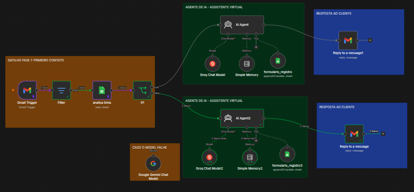
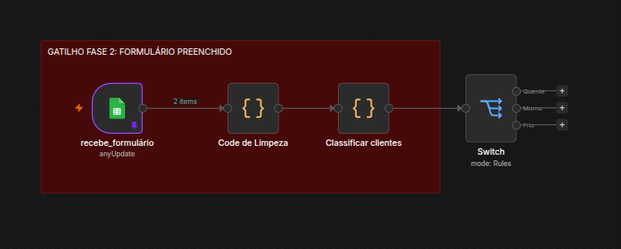

# Análise do Workflow Auto-io_v2 (n8n)

O workflow completo do trabalho será dividido em 4 fases:
FASE 1: PRIMEIRO CONTATO, FASE 2: FORMULÁRIO PREENCHIDO, FASE 3: PROPOSTA E CONTRATO e FASE 4: ENTREGA FINAL

## Visão Geral


Versão: v2

Nessa versão, há mudanças e correções principalmente na fase 1 para que tenha uma maior integração entre os fluxos das fases. Logo após, há integração parcial da FASE 2. 

**FASE 1: PRIMEIRO CONTATO**

Nova FASE 1: Fase 1 (E-mail) captura, filtra (8 condições), verifica existência do lead na planilha e direciona para AI Agent (leads existentes com ofertas personalizadas) ou AI Agent2 (leads novos com convite ao formulário). 

**FASE 2: FORMULÁRIO PREENCHIDO**

Fase 2 (Formulário): trigger do Google Sheets, Code de Limpeza (validação de dados), Classificar clientes (Quente/Morno/Frio) e Switch para segmentação.

---

## Arquitetura do Sistema

### 🔄 Fluxo Principal

O workflow é dividido em **duas fases principais** que operam em paralelo:

```
📧 E-mail Recebido → Filtro Anti-Spam → Verificação na Planilha → Resposta Automatizada
                                                                              ↓
📋 Formulário Preenchido → Limpeza de Dados → Classificação de Lead → Switch
```

---

## 📌 Fase 1: Primeiro Contato (E-mail)



### Gatilho
- **Gmail Trigger** (`Gmail Trigger`) - Monitora a caixa de entrada a cada minuto

### Filtragem
- **Filter** - Remove e-mails que contenham:
  - Palavras como "unsubscribe", "newsletter", "mailer-daemon"
  - Assuntos com "[SPAM]"
  - E-mails enviados pelo próprio domínio

### Verificação na Planilha
- **analisa linha** - Consulta o Google Sheets para verificar se o lead já existe
- **If1** - Decide o fluxo com base no resultado:
  - **Lead existente** → Fluxo de resposta com ofertas personalizadas
  - **Lead novo** → Fluxo de captura de informações

### Assistentes Virtuais (IA)

#### 🤖 Fluxo Lead Existente (`AI Agent`)
- Modelo: **Groq Chat Model** (LLaMA 3.3 70B)
- Memória: **Simple Memory** (30 mensagens de contexto)
- Prompt: "AQUI ENTROU NO FLUxo que ExISTE o e-mail na planilha"
- **Ferramenta**: `formulario_registro` - Acesso à planilha para consulta de dados do cliente
- Saída: E-mail personalizado com ofertas baseadas no perfil do cliente

#### 🤖 Fluxo Lead Novo (`AI Agent2`)
- Modelo: **Google Gemini Chat Model**
- Memória: **Simple Memory2**
- Prompt: "AQUI ENTROU NO FLUxo que NÃO ExISTE o e-mail na planilha"
- **Ferramenta**: `formulario_registro3` - Para cadastrar novo lead
- Objetivo: Convidar o lead para preencher o formulário de diagnóstico
- Saída: E-mail com link para formulário

### Respostas
- **Reply to a message1** - Responde e-mail no Gmail (lead existente)
- **Reply to a message** - Responde e-mail no Gmail (lead novo)

---

## 📋 Fase 2: Formulário Preenchido




### Gatilho
- **recebe_formulário** - Monitora mudanças na planilha do Google Sheets

### Processamento de Dados
1. **Code de Limpeza** - Python:
   - Limpeza de textos
   - Validação de e-mail, telefone e CNPJ
   - Extração de palavras-chave
   - Detecção de urgência

2. **Classificar clientes** - Python:
   - Pontuação baseada em palavras-chave
   - Classificação do lead em:
     - 🔥 **Quente** (prioridade máxima)
     - 🌤️ **Morno** (bom potencial)
     - ❄️ **Frio** (nutrir com conteúdo)

3. **Switch** - Encaminha para os diferentes fluxos de classificação

### Prompts Personalizados
Cada agente possui um **system prompt detalhado** que define:
- Personalidade da assistente (Ana)
- Tom de voz (profissional e acolhedor)
- Regras de negócio
- Perguntas frequentes
- Formatação HTML obrigatória

### Ferramentas
- **formulario_registro** - Acesso à planilha Google Sheets
- Capacidade de **append/update** na planilha

---

## 📊 Estrutura de Dados

### Planilha Google Sheets
O workflow utiliza uma planilha com **22 colunas** para armazenar:

**Campos de Identificação:**
- Timestamp, Nome, Empresa, Cargo, E-mail, Telefone, Segmento

**Campos de Diagnóstico:**
- Processo crítico, Descrição do processo, Quem faz o quê
- Ferramentas utilizadas, Onde estão as informações

**Campos de Análise:**
- Gargalos, Repetições desnecessárias, Perda de informação
- Resultado ideal, Objetivo principal, Prazo

**Campos Complementares:**
- Reunião (sim/não), Observações, CNPJ, Quantos funcionários

